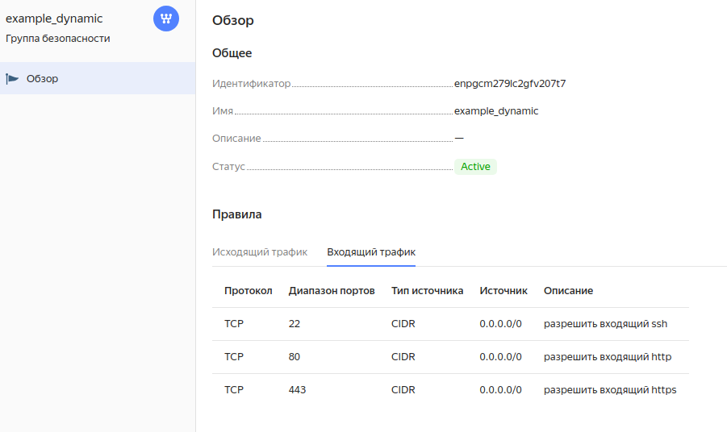

# Домашнее задание к занятию «Управляющие конструкции в коде Terraform»

1. **Приложите скриншот входящих правил "Группы безопасности" в ЛК Yandex Cloud или скриншот отказа в предоставлении доступа к preview версии.**

    Ответ:
    


    Ошибка:
```
│ Error: Error while requesting API to create instance:
server-request-id = 47f791bc-f09c-4684-8471-06b2bb0f2ffd
server-trace-id = eb5fea3df357c7ca:81039b2881f1d4ee:eb5fea3df357c7ca:1)
client-request-id = 86d275f8-dafa-4c99-8123-a5c3f71c33c7
client-trace-id = a7b2109f-24a3-469f-86ab-b492f0f5db6f rpc
error: code = InvalidArgument
desc = the specified number of cores is not available on platform "standard-v1"; allowed core number: 2, 4
│
│   with yandex_compute_instance.platform,
│   on main.tf line 15, in resource "yandex_compute_instance" "platform":
│   15: resource "yandex_compute_instance" "platform" {
```

   Ответ: Ошибка обозначает, что нельзя создать ВМ с количеством ядер - **1**. Можно только с 2мя или 4мя ядрами.
