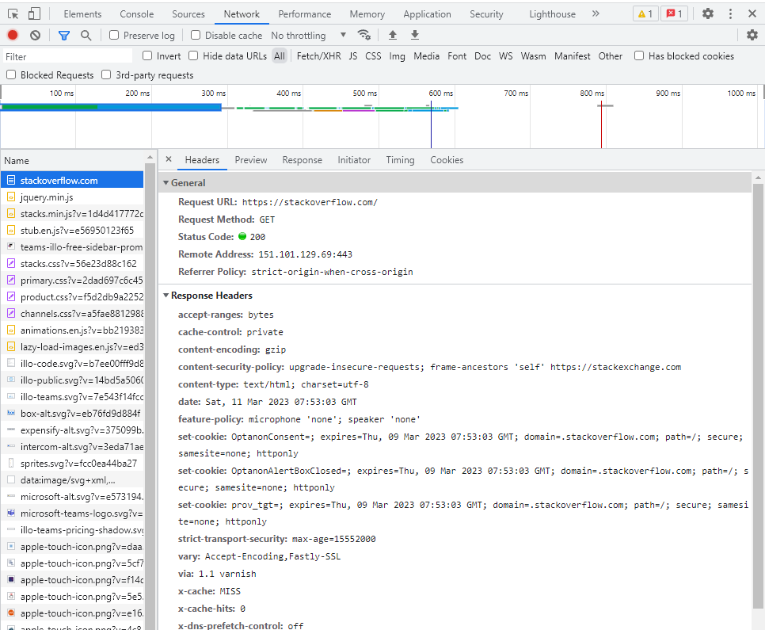
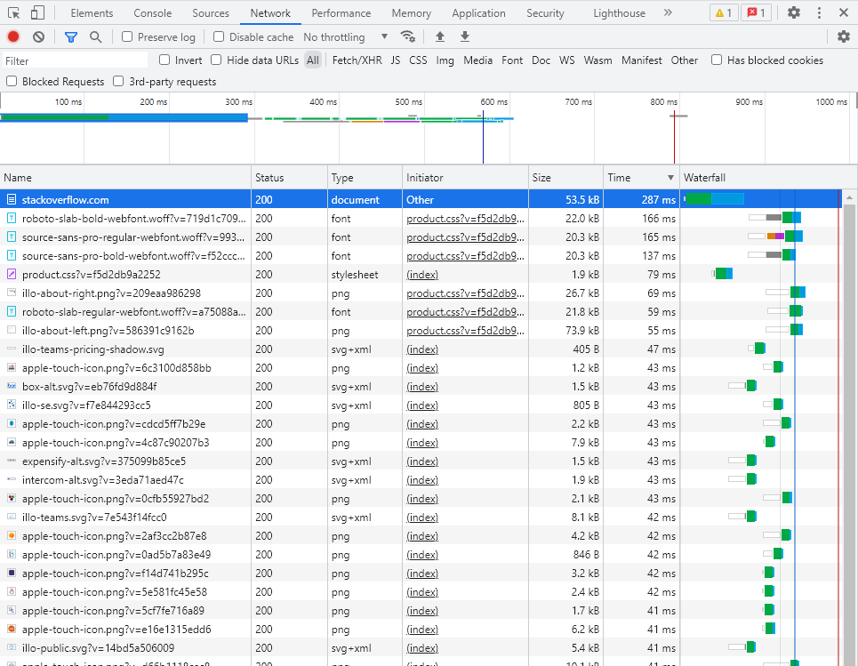

## Ответы к домашнему заданию к занятию
# «Компьютерные сети. Лекция 1»

1. **Подключитесь утилитой telnet к сайту stackoverflow.com. Отправьте HTTP-запрос. В ответе укажите полученный HTTP-код и поясните, что он означает.**
    ```
    fedor@DESKTOP-FEKCCDN:~$ telnet stackoverflow.com 80
    Trying 151.101.193.69...
    Connected to stackoverflow.com.
    Escape character is '^]'.
    GET /questions HTTP/1.0

    HTTP/1.1 500 Domain Not Found
    Connection: close
    Content-Length: 228
    Server: Varnish
    Retry-After: 0
    content-type: text/html
    Cache-Control: private, no-cache
    X-Served-By: cache-fra-eddf8230125-FRA
    Accept-Ranges: bytes
    Date: Sat, 11 Mar 2023 07:31:58 GMT
    Via: 1.1 varnish


    <html>
    <head>
    <title>Fastly error: unknown domain </title>
    </head>
    <body>
    <p>Fastly error: unknown domain: . Please check that this domain has been added to a service.</p>
    <p>Details: cache-fra-eddf8230125-FRA</p></body></html>Connection closed by foreign host.
    fedor@DESKTOP-FEKCCDN:~$
    ```
  
    Код ответа: **500**. В RFC написано, что он обозначает::
    ```
    500 Internal Server Error

    The server encountered an unexpected condition which prevented it
    from fulfilling the request.
    ```
    
    Но в заголовке ответа сервера почему то написано **`500 Domain Not Found`** и **`Fastly error: unknown domain`**
    
2. **Повторите задание 1 в браузере, используя консоль разработчика F12. укажите в ответе полученный HTTP-код**

    Код ответа: **200**:
    
    
    **Проверьте время загрузки страницы и определите, какой запрос обрабатывался дольше всего**
    
    Дольше всего обрабатывался первый запрос, **287** миллисекунд:
    

3. **Какой IP-адрес у вас в интернете?**

    ```
    fedor@DESKTOP-FEKCCDN:~$ wget -qO- ifconfig.me/ip
    79.164.46.76
    fedor@DESKTOP-FEKCCDN:~$
    ```

4. **Какому провайдеру принадлежит ваш IP-адрес? Какой автономной системе AS? Воспользуйтесь утилитой whois.**

    Провайдер: **Neo-CNT, Russian Central Telegraph, Moscow**:

    ```
    fedor@DESKTOP-FEKCCDN:~$ whois 79.164.46.76
    % This is the RIPE Database query service.
    % The objects are in RPSL format.
    %
    % The RIPE Database is subject to Terms and Conditions.
    % See http://www.ripe.net/db/support/db-terms-conditions.pdf

    % Note: this output has been filtered.
    %       To receive output for a database update, use the "-B" flag.

    % Information related to '79.164.32.0 - 79.164.63.255'

    % Abuse contact for '79.164.32.0 - 79.164.63.255' is 'abuse@cnt.ru'

    inetnum:        79.164.32.0 - 79.164.63.255
    netname:        Neo-CNT
    descr:          Russian Central Telegraph, Moscow
    country:        RU
    admin-c:        VYK9-RIPE
    admin-c:        AAP43-RIPE
    tech-c:         VYK9-RIPE
    status:         ASSIGNED PA
    remarks:        INFRA-AW
    mnt-by:         CNT-MNT
    created:        2011-03-30T14:09:55Z
    last-modified:  2011-03-30T14:09:55Z
    source:         RIPE # Filtered

    person:         Alexey A Petrov
    address:        7, Tverskaya st.,
    address:        Central Telegraph, Moscow,
    address:        125375, Russia
    phone:          +7 495 504 3825
    nic-hdl:        AAP43-RIPE
    mnt-by:         CNT-MNT
    remarks:        Network Administrator
    created:        2004-06-17T13:15:46Z
    last-modified:  2017-08-25T12:15:16Z
    source:         RIPE # Filtered

    person:         Victor Y. Kovalenko
    address:        Central Telegraph
    address:        7, Tverskaya st.
    address:        103375, Moscow, Russia
    phone:          +7 495 504 4414
    nic-hdl:        VYK9-RIPE
    mnt-by:         CNT-MNT
    remarks:        Network Administrator
    created:        1970-01-01T00:00:00Z
    last-modified:  2013-10-22T07:57:07Z
    source:         RIPE # Filtered

    % Information related to '79.164.0.0/16AS8615'

    route:          79.164.0.0/16
    descr:          CNT-network BLOCK
    origin:         AS8615
    mnt-by:         CNT-MNT
    created:        2013-12-17T07:03:34Z
    last-modified:  2013-12-17T07:03:34Z
    source:         RIPE

    % This query was served by the RIPE Database Query Service version 1.106 (ABERDEEN)
    ```

5. **Через какие сети проходит пакет, отправленный с вашего компьютера на адрес 8.8.8.8? Через какие AS? Воспользуйтесь утилитой traceroute.**

    ```
    fedor@DESKTOP-FEKCCDN:~$ traceroute -An 8.8.8.8
    traceroute to 8.8.8.8 (8.8.8.8), 30 hops max, 60 byte packets
     1  172.23.128.1 [*]  0.689 ms  0.478 ms  0.462 ms
     2  192.168.1.1 [*]  86.388 ms  87.128 ms  87.049 ms
     3  10.182.64.1 [*]  89.487 ms  88.489 ms  88.424 ms
     4  213.85.208.254 [AS8615]  88.887 ms  88.723 ms  88.608 ms
     5  188.254.54.237 [AS12389]  186.202 ms  89.333 ms  186.079 ms
     6  * * *
     7  72.14.197.6 [AS15169]  7.217 ms  11.250 ms  11.164 ms
     8  * * *
     9  108.170.225.44 [AS15169]  7.104 ms 108.170.250.129 [AS15169]  96.875 ms 172.253.69.174 [AS15169]  95.501 ms
    10  108.170.250.113 [AS15169]  95.423 ms 108.170.250.66 [AS15169]  93.726 ms  92.429 ms
    11  72.14.234.20 [AS15169]  188.297 ms 142.250.238.214 [AS15169]  101.437 ms 72.14.234.54 [AS15169]  101.338 ms
    12  142.251.238.72 [AS15169]  100.394 ms 142.251.237.148 [AS15169]  100.256 ms 72.14.232.86 [AS15169]  100.149 ms
    13  142.250.56.13 [AS15169]  100.010 ms 74.125.253.147 [AS15169]  99.934 ms 172.253.51.187 [AS15169]  100.922 ms
    14  * * *
    15  * * *
    16  * * *
    17  * * *
    18  * * *
    19  * * *
    20  8.8.8.8 [AS15169/AS263411]  111.511 ms * *
    fedor@DESKTOP-FEKCCDN:~$
    ```

6. **Повторите задание 5 в утилите mtr. На каком участке наибольшая задержка — delay?**

7. **Какие DNS-сервера отвечают за доменное имя dns.google? Какие A-записи? Воспользуйтесь утилитой dig.**

8. **Проверьте PTR записи для IP-адресов из задания 7. Какое доменное имя привязано к IP? Воспользуйтесь утилитой dig.**
