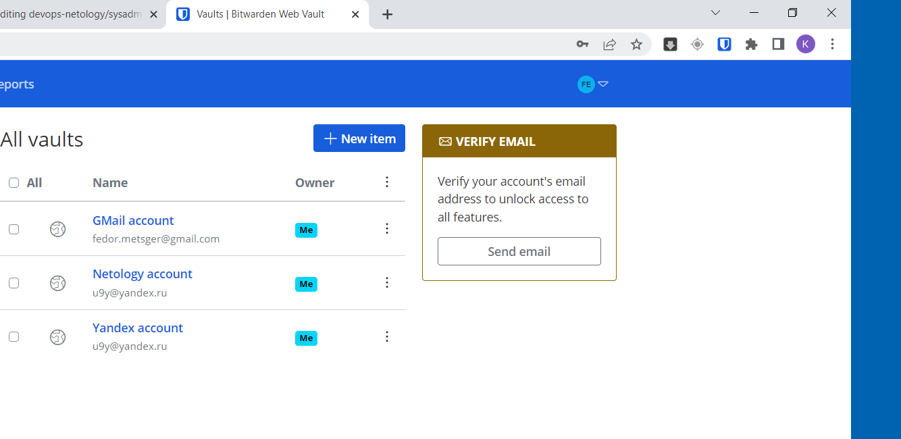

## Ответы к домашнему заданию к занятию
# «Элементы безопасности информационных систем»

1. **Установите плагин Bitwarden для браузера. Зарегестрируйтесь и сохраните несколько паролей.**

  Установил, зарегестрировался, сохранил пароли:
  

2. **Установите Google Authenticator на мобильный телефон. Настройте вход в Bitwarden-акаунт через Google Authenticator OTP.**

  

3. **Установите apache2, сгенерируйте самоподписанный сертификат, настройте тестовый сайт для работы по HTTPS.**

  Всё сделал по инструкции, сайт на порту 443 виден:
  
  
  Правда при входе видно предупреждение о небезопасности сайта:
  

4. **Проверьте на TLS-уязвимости произвольный сайт в интернете.**

  ```
  fedor@DESKTOP-FEKCCDN:~$ ./testssl.sh --warnings=off -e --fast --parallel https://sbercloud.ru/

  ATTENTION: No cipher mapping file found!
  Please note from 2.9 on testssl.sh needs files in "$TESTSSL_INSTALL_DIR/etc/" to function correctly.


  ATTENTION: No TLS data file found -- needed for socket-based handshakes
  Please note from 2.9 on testssl.sh needs files in "$TESTSSL_INSTALL_DIR/etc/" to function correctly.


  ###########################################################
    testssl.sh       3.2rc2 from https://testssl.sh/dev/

        This program is free software. Distribution and
               modification under GPLv2 permitted.
        USAGE w/o ANY WARRANTY. USE IT AT YOUR OWN RISK!

        Please file bugs @ https://testssl.sh/bugs/

  ###########################################################

    Using "OpenSSL 3.0.2 15 Mar 2022 (Library: OpenSSL 3.0.2 15 Mar 2022)" [~93 ciphers]
    on DESKTOP-FEKCCDN:/usr/bin/openssl
    (built: "Feb  6 17:57:17 2023", platform: "debian-amd64")


    Start 2023-03-14 14:13:15        -->> 178.248.232.192:443 (sbercloud.ru) <<--

    rDNS (178.248.232.192): --
    Testing with sbercloud.ru:443 only worked using /usr/bin/openssl.
    Test results may be somewhat better if the --ssl-native option is used.
    Service detected:       HTTP


    Testing all 93 locally available ciphers against the server, ordered by encryption strength


  Hexcode  Cipher Suite Name (OpenSSL)       KeyExch.   Encryption  Bits
  --------------------------------------------------------------------------
    x1302   TLS_AES_256_GCM_SHA384            ECDH 253   AESGCM      256
    x1303   TLS_CHACHA20_POLY1305_SHA256      ECDH 253   CHACHA20    256


    Done 2023-03-14 14:13:59 [  47s] -->> 178.248.232.192:443 (sbercloud.ru) <<--


  fedor@DESKTOP-FEKCCDN:~$
  ```

5. **Установите на Ubuntu SSH-сервер, сгенерируйте новый приватный ключ. Скопируйте свой публичный ключ на другой сервер. Подключитесь к серверу по SSH-ключу.**

  ```
  fedor@DESKTOP-FEKCCDN:~$ ssh-keygen
  Generating public/private rsa key pair.
  Enter file in which to save the key (/home/fedor/.ssh/id_rsa):
  /home/fedor/.ssh/id_rsa already exists.
  Overwrite (y/n)? y
  Enter passphrase (empty for no passphrase):
  Enter same passphrase again:
  Your identification has been saved in /home/fedor/.ssh/id_rsa
  Your public key has been saved in /home/fedor/.ssh/id_rsa.pub
  The key fingerprint is:
  SHA256:Zoqzxdt24cq3Z986Y7WVZhTCJ4aNOFLy36hIfv4ZGa0 fedor@DESKTOP-FEKCCDN
  The key's randomart image is:
  +---[RSA 3072]----+
  |       .... =    |
  |       .oo o * o |
  |        ... . + .|
  |          . +  . |
  |       .S  + o. .|
  |     oo+. o +  +o|
  |    o +o + E  o.o|
  |     + ++ + = +o |
  |    . ..+=o* oo+.|
  +----[SHA256]-----+
  fedor@DESKTOP-FEKCCDN:~$ ssh-copy-id -p 2222 vagrant@192.168.1.42
  /usr/bin/ssh-copy-id: INFO: Source of key(s) to be installed: "/home/fedor/.ssh/id_rsa.pub"
  /usr/bin/ssh-copy-id: INFO: attempting to log in with the new key(s), to filter out any that are already installed
  /usr/bin/ssh-copy-id: INFO: 1 key(s) remain to be installed -- if you are prompted now it is to install the new keys
  vagrant@192.168.1.42's password:

  Number of key(s) added: 1

  Now try logging into the machine, with:   "ssh -p '2222' 'vagrant@192.168.1.42'"
  and check to make sure that only the key(s) you wanted were added.

  fedor@DESKTOP-FEKCCDN:~$ ssh -p 2222 vagrant@192.168.1.42
  Welcome to Ubuntu 20.04.5 LTS (GNU/Linux 5.4.0-135-generic x86_64)

   * Documentation:  https://help.ubuntu.com
   * Management:     https://landscape.canonical.com
   * Support:        https://ubuntu.com/advantage

    System information as of Tue 14 Mar 2023 11:22:01 AM UTC

    System load:  0.0                Users logged in:         1
    Usage of /:   12.4% of 30.34GB   IPv4 address for dummy0: 10.10.1.1
    Memory usage: 41%                IPv4 address for dummy1: 10.10.2.1
    Swap usage:   0%                 IPv4 address for eth0:   10.0.2.15
    Processes:    130


  This system is built by the Bento project by Chef Software
  More information can be found at https://github.com/chef/bento
  Last login: Sun Mar 12 12:23:27 2023 from 10.0.2.2
  vagrant@vagrant:~$
  ```

6. **Переименуйте файлы ключей из задания 5. Настройте файл конфигурации SSH-клиента так, чтобы вход на удалённый сервер осуществлялся по имени сервера.**
  ```
  fedor@DESKTOP-FEKCCDN:~$ mv .ssh/id_rsa .ssh/id_rsa1
  fedor@DESKTOP-FEKCCDN:~$ mv .ssh/id_rsa.pub .ssh/id_rsa1.pub
  fedor@DESKTOP-FEKCCDN:~$ cat .ssh/config
  Host vagrant-vm
    HostName 192.168.1.42
    IdentityFile ~/.ssh/id_rsa1
    User vagrant
    Port 2222
  fedor@DESKTOP-FEKCCDN:~$ ssh vagrant-vm
  Welcome to Ubuntu 20.04.5 LTS (GNU/Linux 5.4.0-135-generic x86_64)

  * Documentation:  https://help.ubuntu.com
  * Management:     https://landscape.canonical.com
  * Support:        https://ubuntu.com/advantage

    System information as of Tue 14 Mar 2023 11:32:15 AM UTC

    System load:  0.0                Users logged in:         1
    Usage of /:   12.4% of 30.34GB   IPv4 address for dummy0: 10.10.1.1
    Memory usage: 42%                IPv4 address for dummy1: 10.10.2.1
    Swap usage:   0%                 IPv4 address for eth0:   10.0.2.15
    Processes:    131


  This system is built by the Bento project by Chef Software
  More information can be found at https://github.com/chef/bento
  Last login: Tue Mar 14 11:31:50 2023 from 10.0.2.2
  vagrant@vagrant:~$
  ```

7. **Соберите дамп трафика утилитой tcpdump в формате pcap, 100 пакетов. Откройте файл pcap в Wireshark.**

  **tcpdump**:
  ```
  fedor@DESKTOP-FEKCCDN:~$ sudo tcpdump -c 100 -w tcpdump.out
  tcpdump: listening on eth0, link-type EN10MB (Ethernet), snapshot length 262144 bytes
  100 packets captured
  108 packets received by filter
  0 packets dropped by kernel
  fedor@DESKTOP-FEKCCDN:~$ file tcpdump.out
  tcpdump.out: pcap capture file, microsecond ts (little-endian) - version 2.4 (Ethernet, capture length 262144)
  fedor@DESKTOP-FEKCCDN:~$
  ```
  
  **Wireshark**:  
  
