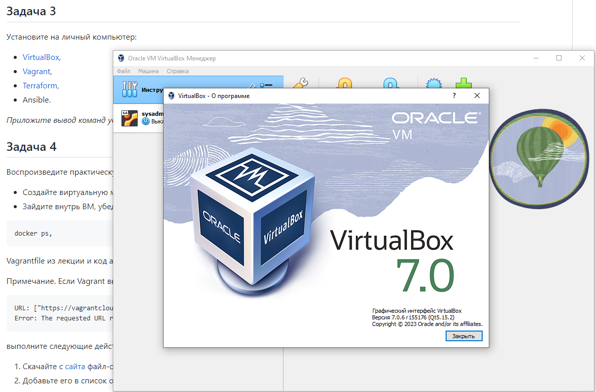
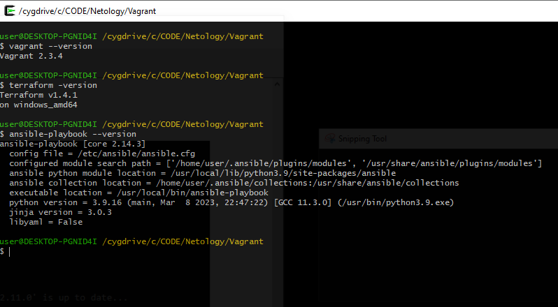

# Домашнее задание к занятию 2. «Применение принципов IaaC в работе с виртуальными машинами»


### 1. Опишите основные преимущества применения на практике IaaC-паттернов.

**CI (Continuous Integration)** - практика автоматизации интеграции изменений кода от нескольких участников в единый программный проект.
Это основная передовая практика DevOps, позволяющая разработчикам часто объединять
изменения кода в центральный репозиторий, где затем выполняются сборки и тесты.

**CD (Continuous Delivery)** - подход, при котором команды производят программное обеспечение в короткие циклы,
гарантируя, что программное обеспечение может быть надежно выпущено в любое время и
без необходимости делать это вручную. Он направлен на создание, тестирование и выпуск обновлений
программного обеспечения с большей скоростью и частотой.

**CD (Continuous Deployment)** - стратегия разработки программного обеспечения, при которой изменения в коде приложения
автоматически передаются в производственную среду. Эта автоматизация сопровождается серией предопределенных тестов.
Как только обновления проходят эти тесты, система отправляет обновления непосредственно пользователям программного обеспечения.

### Какой из принципов IaaC является основополагающим?
**IaaC** должен обеспечивать **идемпотентность**, независимо от того, сколько раз он выполняется.
То есть, всякий раз, когда операция запускается повторно, или добавляются новые элементы инфраструктуры,
все настройки, конфигурации, имена, версии ПО итд. автоматически будут одними и теми же.


### 2. Чем Ansible выгодно отличается от других систем управление конфигурациями?
- Простота установки
- Низкий порог вхождения
- Скорость работы
- Гибкость настройки
- Возможность работы с большой и сложной инфраструктурой

### Какой, на ваш взгляд, метод работы систем конфигурации более надёжный — push или pull?

- Лучше контроль над всей системой: поскольку главный сервер (на котором вы храните информацию о конфигурации) передает конфигурацию узлам,
у вас больше контроля над тем, какие узлы необходимо настроить, действия становятся более синхронными,
а обработка ошибок становится намного проще, поскольку вы может увидеть и исправить проблемы в одном месте.
- Проще использовать: инструменты управления принудительной конфигурацией, такие как Ansible, как правило, гораздо проще настроить и начать работу.
Не обязательна установка клиента на узлы. Кроме того, поскольку узлы не извлекают какую-либо информацию с главного сервера,
разработка становится более простой, нет риска, что какой-либо узел случайно получит некорректную конфигурацию или изменит какие-либо настройки агентов.

### 3. Установите на личный компьютер:
- VirtualBox,
- Vagrant,
- Terraform,
- Ansible.
### Приложите вывод команд установленных версий каждой из программ, оформленный в Markdown.




### 4. Воспроизведите практическую часть лекции самостоятельно.
- Создайте виртуальную машину.
```
user@DESKTOP-PGNID4I /cygdrive/c/CODE/Netology/Vagrant
$ vagrant up
Bringing machine 'server1.netology' up with 'virtualbox' provider...
==> server1.netology: Importing base box 'bento/ubuntu-20.04'...
==> server1.netology: Matching MAC address for NAT networking...
==> server1.netology: Checking if box 'bento/ubuntu-20.04' version '202212.11.0' is up to date...
==> server1.netology: Setting the name of the VM: server1.netology
==> server1.netology: Clearing any previously set network interfaces...
==> server1.netology: Preparing network interfaces based on configuration...
    server1.netology: Adapter 1: nat
    server1.netology: Adapter 2: hostonly
==> server1.netology: Forwarding ports...
    server1.netology: 22 (guest) => 20011 (host) (adapter 1)
    server1.netology: 22 (guest) => 2222 (host) (adapter 1)
==> server1.netology: Running 'pre-boot' VM customizations...
==> server1.netology: Booting VM...
==> server1.netology: Waiting for machine to boot. This may take a few minutes...
    server1.netology: SSH address: 127.0.0.1:2222
    server1.netology: SSH username: vagrant
    server1.netology: SSH auth method: private key
    server1.netology: Warning: Connection reset. Retrying...
    server1.netology:
    server1.netology: Vagrant insecure key detected. Vagrant will automatically replace
    server1.netology: this with a newly generated keypair for better security.
    server1.netology:
    server1.netology: Inserting generated public key within guest...
    server1.netology: Removing insecure key from the guest if it's present...
    server1.netology: Key inserted! Disconnecting and reconnecting using new SSH key...
==> server1.netology: Machine booted and ready!
==> server1.netology: Checking for guest additions in VM...
    server1.netology: The guest additions on this VM do not match the installed version of
    server1.netology: VirtualBox! In most cases this is fine, but in rare cases it can
    server1.netology: prevent things such as shared folders from working properly. If you see
    server1.netology: shared folder errors, please make sure the guest additions within the
    server1.netology: virtual machine match the version of VirtualBox you have installed on
    server1.netology: your host and reload your VM.
    server1.netology:
    server1.netology: Guest Additions Version: 6.1.40 r154048
    server1.netology: VirtualBox Version: 7.0
==> server1.netology: Setting hostname...
==> server1.netology: Configuring and enabling network interfaces...
==> server1.netology: Mounting shared folders...
    server1.netology: /vagrant => C:/CODE/Netology/Vagrant
==> server1.netology: Running provisioner: ansible...
Windows is not officially supported for the Ansible Control Machine.
Please check https://docs.ansible.com/intro_installation.html#control-machine-requirements
    server1.netology: Running ansible-playbook...

PLAY [nodes] *******************************************************************

TASK [Gathering Facts] *********************************************************
ok: [server1.netology]

TASK [Create directory for ssh-keys] *******************************************
ok: [server1.netology]

TASK [Adding rsa-key in /root/.ssh/authorized_keys] ****************************
An exception occurred during task execution. To see the full traceback, use -vvv. The error was: If you are using a module and expect the file to exist
on the remote, see the remote_src option
fatal: [server1.netology]: FAILED! => {"changed": false, "msg": "Could not find or access '~/.ssh/id_rsa.pub' on the Ansible Controller.\nIf you are usi
ng a module and expect the file to exist on the remote, see the remote_src option"}
...ignoring

TASK [Checking DNS] ************************************************************
changed: [server1.netology]

TASK [Installing tools] ********************************************************
[DEPRECATION WARNING]: Invoking "apt" only once while using a loop via
squash_actions is deprecated. Instead of using a loop to supply multiple items
and specifying `package: "{{ item }}"`, please use `package: ['git', 'curl']`
and remove the loop. This feature will be removed in version 2.11. Deprecation
warnings can be disabled by setting deprecation_warnings=False in ansible.cfg.
ok: [server1.netology] => (item=['git', 'curl'])

TASK [Installing docker] *******************************************************
 [WARNING]: Could not find aptitude. Using apt-get instead
changed: [server1.netology]

TASK [Add the current user to docker group] ************************************
 [WARNING]: Consider using the get_url or uri module rather than running
'curl'.  If you need to use command because get_url or uri is insufficient you
can add 'warn: false' to this command task or set 'command_warnings=False' in
ansible.cfg to get rid of this message.
changed: [server1.netology]

PLAY RECAP *********************************************************************
server1.netology           : ok=7    changed=3    unreachable=0    failed=0    skipped=0    rescued=0    ignored=1


user@DESKTOP-PGNID4I /cygdrive/c/CODE/Netology/Vagrant
$
```
- Зайдите внутрь ВМ, убедитесь, что Docker установлен с помощью команды docker ps, Vagrantfile из лекции и код ansible находятся в папке.
```
vagrant@server1:~$ docker ps
CONTAINER ID   IMAGE     COMMAND   CREATED   STATUS    PORTS     NAMES
vagrant@server1:~$ docker version
Client: Docker Engine - Community
 Version:           23.0.1
 API version:       1.42
 Go version:        go1.19.5
 Git commit:        a5ee5b1
 Built:             Thu Feb  9 19:46:56 2023
 OS/Arch:           linux/amd64
 Context:           default

Server: Docker Engine - Community
 Engine:
  Version:          23.0.1
  API version:      1.42 (minimum version 1.12)
  Go version:       go1.19.5
  Git commit:       bc3805a
  Built:            Thu Feb  9 19:46:56 2023
  OS/Arch:          linux/amd64
  Experimental:     false
 containerd:
  Version:          1.6.18
  GitCommit:        2456e983eb9e37e47538f59ea18f2043c9a73640
 runc:
  Version:          1.1.4
  GitCommit:        v1.1.4-0-g5fd4c4d
 docker-init:
  Version:          0.19.0
  GitCommit:        de40ad0
vagrant@server1:~$
```

