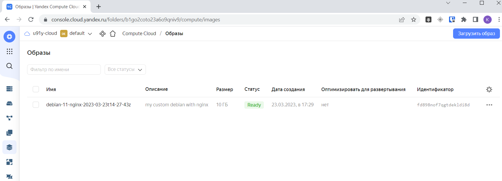

# Домашнее задание к занятию 4. «Оркестрация группой Docker-контейнеров на примере Docker Compose»

### 1. Создайте собственный образ любой операционной системы (например ubuntu-20.04) с помощью Packer (инструкция). Чтобы получить зачёт, вам нужно предоставить скриншот страницы с созданным образом из личного кабинета YandexCloud.
Ответ:


### 2.1. Создайте вашу первую виртуальную машину в YandexCloud с помощью web-интерфейса YandexCloud.

### 2.2.* (Необязательное задание) Создайте вашу первую виртуальную машину в YandexCloud с помощью Terraform (вместо использования веб-интерфейса YandexCloud). Используйте Terraform-код в директории (src/terraform). Чтобы получить зачёт, вам нужно предоставить вывод команды terraform apply и страницы свойств, созданной ВМ из личного кабинета YandexCloud.
Ответ:
```
fedor@DESKTOP-FEKCCDN:~/Netology/DevOps/hw_packer_terraform/terraform$ terraform apply

Terraform used the selected providers to generate the following execution plan. Resource actions are indicated with the following
symbols:
  + create

Terraform will perform the following actions:

  # yandex_compute_instance.node01 will be created
  + resource "yandex_compute_instance" "node01" {
      + allow_stopping_for_update = true
      + created_at                = (known after apply)
      + folder_id                 = (known after apply)
      + fqdn                      = (known after apply)
      + gpu_cluster_id            = (known after apply)
      + hostname                  = "node01.netology.cloud"
      + id                        = (known after apply)
      + metadata                  = {
          + "ssh-keys" = <<-EOT
                centos:ssh-rsa AAAAB3NzaC1yc2EAAAADAQABAAABgQDmAQm4S2bJ8BP+Cj+9JNcAQcGhhieeYwcxglNJN7+zDvZhg/7PsxcdYWKcwuQEP6Eu7LylGyKIoMMM1nJ/xojJx6p4mkMbNZI239Bkju5+pej0OJSCPTZjMTsOp0RkGmeMuvFEE89MsGCU1hf6AZwBR5Jtn4SrHS5GAXwxgNA6zK/BcI7fhNflhMIcfvBYq1+y/s5f6EniUTMtijIW3aWVr4rdWKsznlTkQpPlI2Rr6Qzy5OsoS2gk0+rFD2V7rzVe9Djplp5taxqVY1oA0MpoqM10gQoxaY12GIK0WElMMjFzeysV21IdI345015tTmXxS2EVryUrWsS4BryhbnansDUgihI1Sr5kKeEeK9d3Wqi6uFDcDwizB3Cne7dr0RpT+7gpbvTMyM6AB1ON3MrE28GDUNjTlaEgRyRvYynIx/bEVIO+XvBDUt2oQdG7dbGPcWppfjkAkJsVcfSRamwSEoD0c5BmJAcp9ez70rUME5n3WUhuWrpbcehY1jMv58M= fedor@DESKTOP-FEKCCDN
            EOT
        }
      + name                      = "node01"
      + network_acceleration_type = "standard"
      + platform_id               = "standard-v1"
      + service_account_id        = (known after apply)
      + status                    = (known after apply)
      + zone                      = "ru-central1-a"

      + boot_disk {
          + auto_delete = true
          + device_name = (known after apply)
          + disk_id     = (known after apply)
          + mode        = (known after apply)

          + initialize_params {
              + block_size  = (known after apply)
              + description = (known after apply)
              + image_id    = "fd8a5gml6hiprer2pke3"
              + name        = "root-node01"
              + size        = 20
              + snapshot_id = (known after apply)
              + type        = "network-hdd"
            }
        }

      + network_interface {
          + index              = (known after apply)
          + ip_address         = (known after apply)
          + ipv4               = true
          + ipv6               = (known after apply)
          + ipv6_address       = (known after apply)
          + mac_address        = (known after apply)
          + nat                = true
          + nat_ip_address     = (known after apply)
          + nat_ip_version     = (known after apply)
          + security_group_ids = (known after apply)
          + subnet_id          = "e9baktrcdpa8io69oc84"
        }

      + resources {
          + core_fraction = 100
          + cores         = 2
          + memory        = 2
        }
    }

Plan: 1 to add, 0 to change, 0 to destroy.

Changes to Outputs:
  + external_ip_address_node01_yandex_cloud = (known after apply)
  + internal_ip_address_node01_yandex_cloud = (known after apply)

Do you want to perform these actions?
  Terraform will perform the actions described above.
  Only 'yes' will be accepted to approve.

  Enter a value: yes

yandex_compute_instance.node01: Creating...
yandex_compute_instance.node01: Still creating... [10s elapsed]
yandex_compute_instance.node01: Still creating... [20s elapsed]
yandex_compute_instance.node01: Still creating... [30s elapsed]
yandex_compute_instance.node01: Still creating... [40s elapsed]
yandex_compute_instance.node01: Still creating... [50s elapsed]
yandex_compute_instance.node01: Creation complete after 59s [id=fhmom7e5nb84g7ienhul]

Apply complete! Resources: 1 added, 0 changed, 0 destroyed.

Outputs:

external_ip_address_node01_yandex_cloud = "51.250.14.212"
internal_ip_address_node01_yandex_cloud = "10.1.2.26"
fedor@DESKTOP-FEKCCDN:~/Netology/DevOps/hw_packer_terraform/terraform$
```
~[image](Capture21.PNG)

### 3. С помощью Ansible и Docker Compose разверните на виртуальной машине из предыдущего задания систему мониторинга на основе Prometheus/Grafana. Используйте Ansible-код в директории (src/ansible).
### Чтобы получить зачёт, вам нужно предоставить вывод команды "docker ps" , все контейнеры, описанные в docker-compose, должны быть в статусе "Up".

### 4. Задача:
1. Откройте веб-браузер, зайдите на страницу http://<внешний_ip_адрес_вашей_ВМ>:3000.
2. Используйте для авторизации логин и пароль из .env-file.
3. Изучите доступный интерфейс, найдите в интерфейсе автоматически созданные docker-compose-панели с графиками(dashboards).
4. Подождите 5-10 минут, чтобы система мониторинга успела накопить данные.
### Чтобы получить зачёт, предоставьте скриншот работающего веб-интерфейса Grafana с текущими метриками.

### 5. (*) Создайте вторую ВМ и подключите её к мониторингу, развёрнутому на первом сервере.
### Чтобы получить зачёт, предоставьте скриншот из Grafana, на котором будут отображаться метрики добавленного вами сервера.
